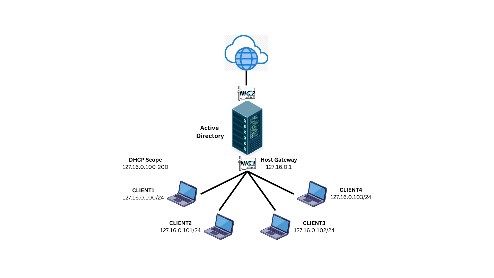
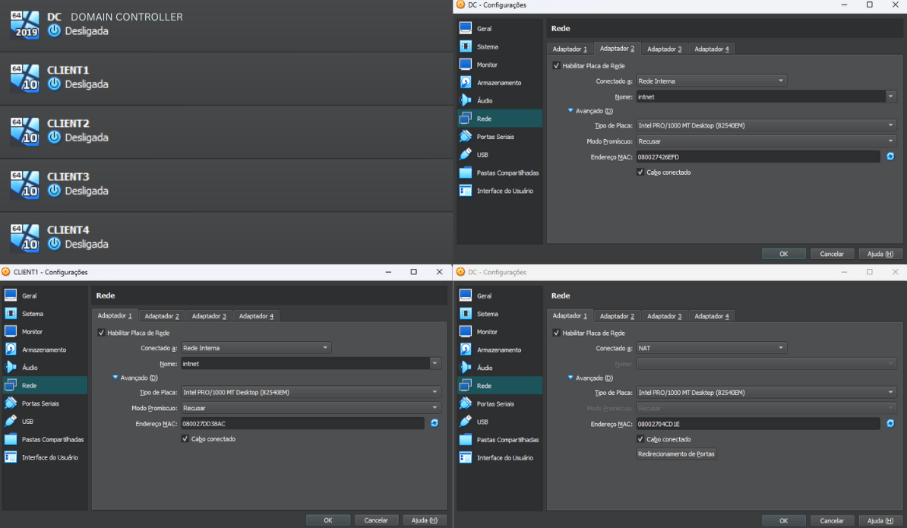
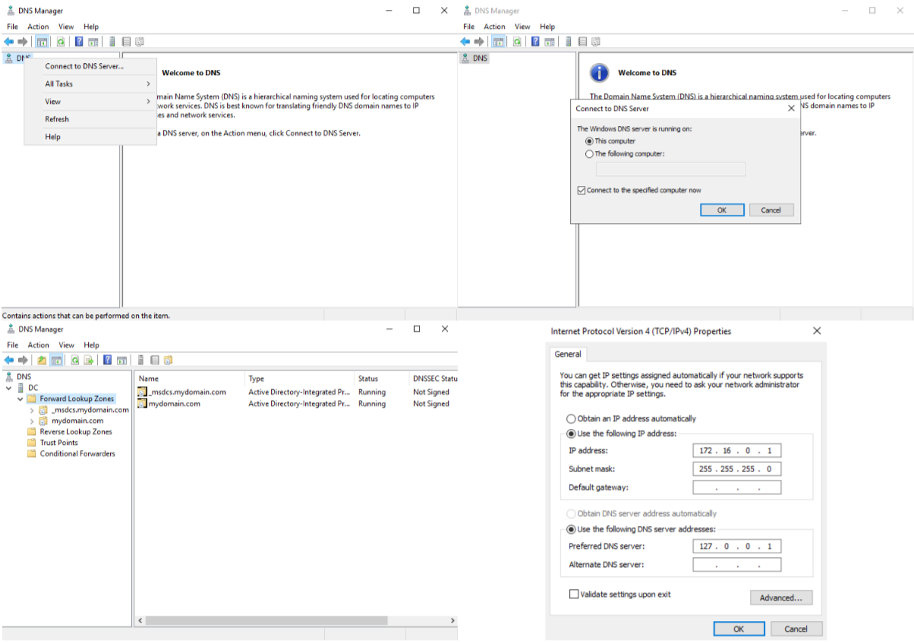
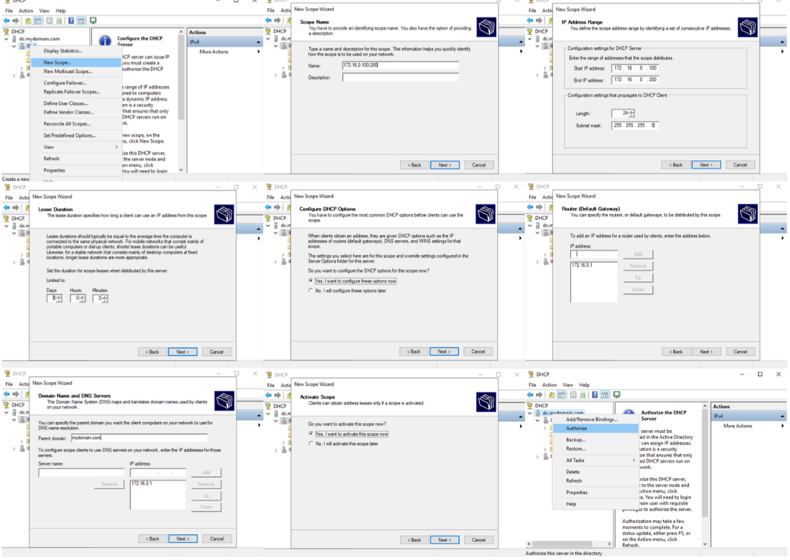

  Este projeto foi criado para documentar experiências hands-on. Com base nos conhecimentos adquiridos durante os estudos para as certificações CompTIA A+ e CompTIA Security+, desenvolvi um Home Lab para este projeto, que será detalhado ao longo desta página. Outros projetos estão em planejamento e serão adicionados futuramente.

>  Como se trata de um Home Lab, a segurança não foi a prioridade neste projeto, e nenhuma das informações sensíveis utilizadas são reais. Em um ambiente de produção, o ideal seria evitar a exposição direta do AD à internet,  implementando um firewall e outras camadas de segurança para proteção da infraestrutura.

Podes também me acompanhar no [LinkedIn!](https://www.linkedin.com/in/julio-nunes-b97331205/).

## Infraestrutura

Este projeto apresenta uma infraestrutura simples, simulando um ambiente Active Directory (AD) em uma organização. Nele, os hosts se conectam a um servidor centralizado, que, por sua vez, gerencia o acesso à internet.

O objetivo principal foi configurar os clientes para receberem automaticamente os parâmetros de rede via DHCP, enquanto o AD atua simultaneamente como servidor DNS.




## Virtual Machines (VMs)

Para a implementação do servidor Active Directory (AD), foi utilizado o Windows Server 2019 em uma máquina virtual (VM). A configuração incluiu duas placas de rede (NICs): uma para comunicação interna e outra para acesso externo.

Os dispositivos cliente (CLIENTs) foram representados por VMs configuradas com Windows 10 Pro, simulando um ambiente corporativo. Cada cliente foi conectado exclusivamente à rede interna, garantindo a comunicação adequada com o servidor AD.



## Instalando AD, DNS, DHCP e Routing

- Ferramentas instaladas no servidor:
  - Active Directory (AD)
  - Domain Name System (DNS)
  - Dynamic Host Configuration Protocol (DHCP)
  - Routing
- Passo a passo:
  - Acesse Add roles and features
  - Selecione os Server Roles desejados
  - Conclua a instalação e reinicie o sistema quando solicitado


## Configurando DNS

Para a configuração do DNS, foi utilizado o IP de loopback como referência, permitindo que o próprio domínio atuasse como servidor DNS para os hosts conectados. Essa abordagem garante que as solicitações de resolução de nomes dentro da rede interna sejam direcionadas corretamente, sem depender de servidores externos. Dessa forma, os dispositivos clientes podem localizar e se comunicar com recursos dentro do ambiente virtualizado de maneira eficiente.



## Configurando DHCP

Para a configuração do serviço DHCP (Dynamic Host Configuration Protocol), foi definido um escopo (Scope) dentro da faixa de endereçamento 172.16.0.100/24 a 172.16.0.200/24, garantindo a distribuição automática de endereços IP para os dispositivos clientes dentro da rede.

- Além da atribuição de endereços IP, foram configurados parâmetros adicionais essenciais para o funcionamento adequado da rede, incluindo:

  - Servidor DNS: Configurado para direcionar as consultas de resolução de nomes dos clientes para o servidor DNS previamente estabelecido na infraestrutura.
  - Gateway 172.16.0.1: Definido para garantir que os dispositivos clientes saibam qual IP utilizar como ponto de saída para a comunicação com redes externas.
  - Lease Duration: Configurado para determinar o período pelo qual um endereço IP atribuído permanecerá reservado para um dispositivo antes de precisar ser renovado, no caso, 8 dias.
 
> Para melhor resolução da imagem, abra em uma nova aba.



###### Header 6

| head1        | head two          | three |
|:-------------|:------------------|:------|
| ok           | good swedish fish | nice  |
| out of stock | good and plenty   | nice  |
| ok           | good `oreos`      | hmm   |
| ok           | good `zoute` drop | yumm  |

### There's a horizontal rule below this.

* * *

### Here is an unordered list:

*   Item foo
*   Item bar
*   Item baz
*   Item zip

### And an ordered list:

1.  Item one
1.  Item two
1.  Item three
1.  Item four

### And a nested list:

- level 1 item
  - level 2 item
  - level 2 item
    - level 3 item
    - level 3 item
- level 1 item
  - level 2 item
  - level 2 item
  - level 2 item
- level 1 item
  - level 2 item
  - level 2 item
- level 1 item

### Small image


### Definition lists can be used with HTML syntax.

<dl>
<dt>Name</dt>
<dd>Godzilla</dd>
<dt>Born</dt>
<dd>1952</dd>
<dt>Birthplace</dt>
<dd>Japan</dd>
<dt>Color</dt>
<dd>Green</dd>
</dl>

```
Long, single-line code blocks should not wrap. They should horizontally scroll if they are too long. This line should be long enough to demonstrate this.
```

```
The final element.
```
