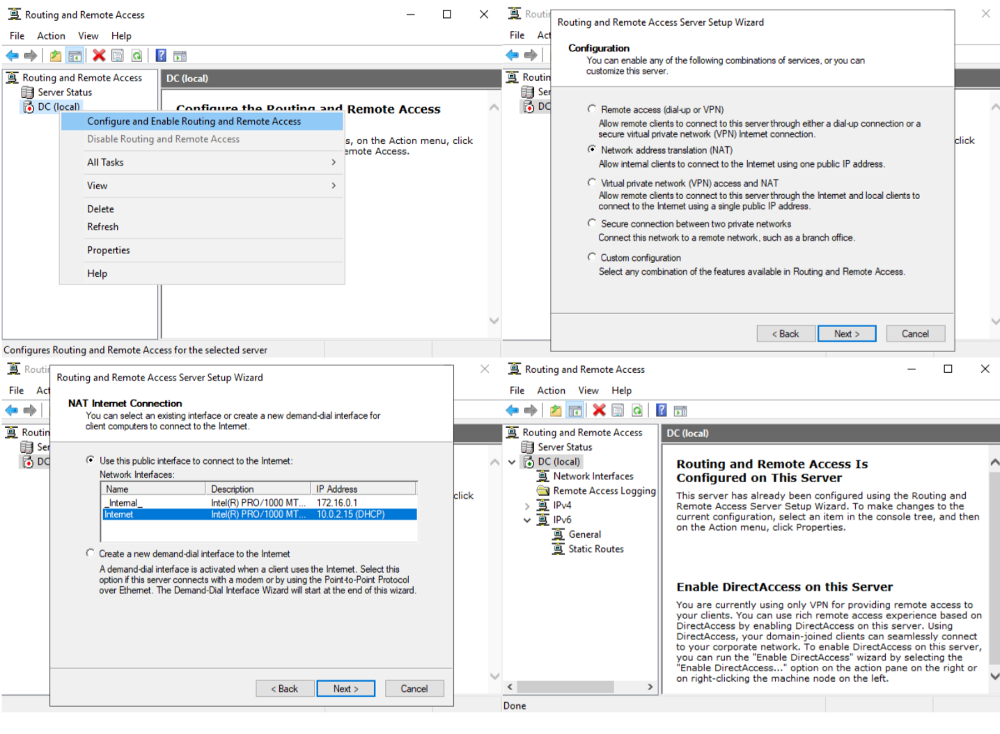
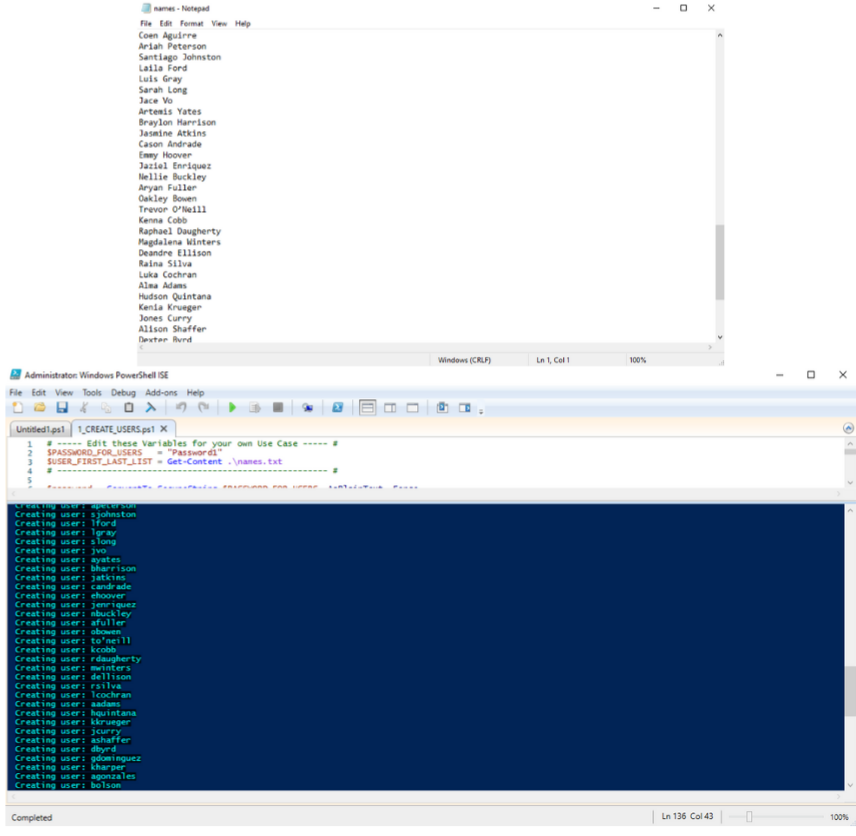
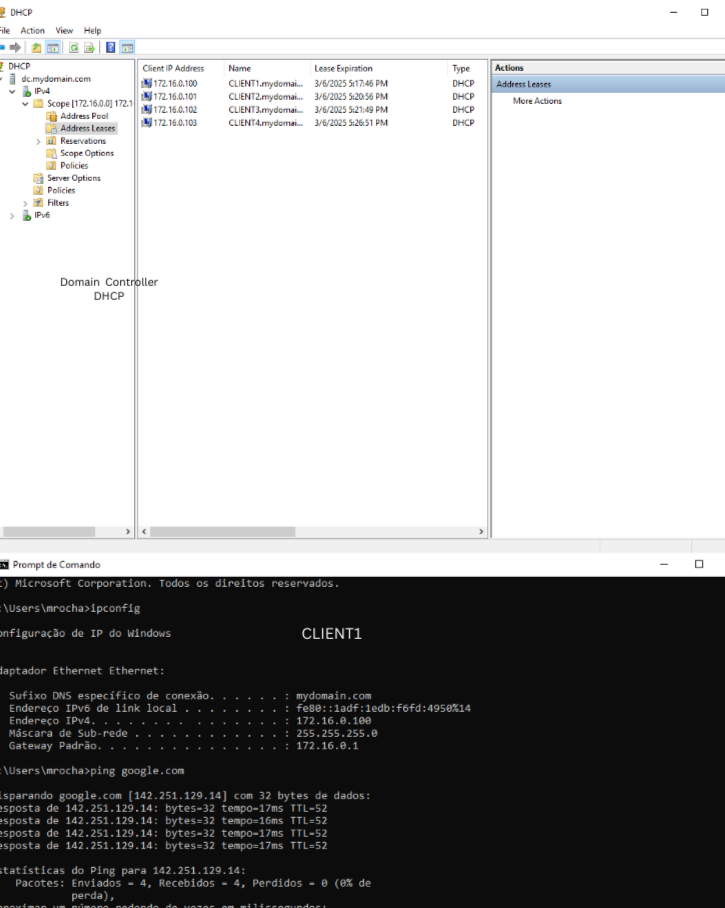

  Este projeto foi criado para documentar experiências hands-on. Com base nos conhecimentos adquiridos durante os estudos para as certificações CompTIA A+ e CompTIA Security+, desenvolvi um Home Lab para este projeto, que será detalhado ao longo desta página. Outros projetos estão em planejamento e serão adicionados futuramente. Me acompanhe no [LinkedIn!](https://www.linkedin.com/in/julio-nunes-b97331205/).

>  Este projeto foi desenvolvido em um ambiente de Home Lab, onde a segurança não foi a prioridade principal, e todas as informações sensíveis utilizadas são fictícias. Em um ambiente de produção, a exposição direta do Active Directory à internet deve ser evitada. Para garantir a integridade, confidencialidade e disponibilidade (CIA) do ambiente, seria essencial a implementação de camadas de segurança, incluindo firewall, redes segmentadas, autenticação multifator (MFA), controle de acesso baseado no princípio do menor privilégio (Least Privilege) e uma abordagem Zero Trust. Além disso, o uso de VPNs para acesso remoto seguro e a aplicação de hardening nos servidores ajudariam a reduzir a superfície de ataque e mitigar riscos.

## Infraestrutura

O projeto apresenta uma infraestrutura simples, simulando um ambiente Active Directory (AD) em uma organização. Nele, os hosts se conectam a um servidor centralizado, que, por sua vez, gerencia o acesso à internet.

O objetivo principal foi configurar os clientes para receberem automaticamente os parâmetros de rede via DHCP, enquanto o AD atua simultaneamente como servidor DNS.

## Virtual Machines (VMs)

Para a implementação do servidor Active Directory (AD), foi utilizado o Windows Server 2019 em uma máquina virtual (VM). A configuração incluiu duas placas de rede (NICs): uma para comunicação interna e outra para acesso externo.

Os dispositivos clientes (CLIENTs) foram representados por VMs configuradas com Windows 10 Pro, simulando um ambiente corporativo. Cada cliente foi conectado exclusivamente à rede interna, garantindo a comunicação adequada com o servidor AD.

## Instalando AD, DNS, DHCP e Routing

- Ferramentas instaladas no servidor:
  - Active Directory (AD)
  - Domain Name System (DNS)
  - Dynamic Host Configuration Protocol (DHCP)
  - Routing and Remote Access (RRAS)
- Passo a passo:
  - Acesse Add roles and features
  - Selecione os Server Roles desejados
  - Conclua a instalação e reinicie o sistema quando solicitado

## Configurando DNS

Para a configuração do DNS, foi utilizado o IP de loopback como referência, permitindo que o próprio domínio atuasse como servidor DNS para os hosts conectados. Essa abordagem garante que as solicitações de resolução de nomes dentro da rede interna sejam direcionadas corretamente, sem depender de servidores externos. Dessa forma, os dispositivos clientes podem localizar e se comunicar com recursos dentro do ambiente virtualizado de maneira eficiente.

## Configurando DHCP

Para a configuração do serviço DHCP (Dynamic Host Configuration Protocol), foi definido um escopo (Scope) dentro da faixa de endereçamento 172.16.0.100/24 a 172.16.0.200/24, garantindo a distribuição automática de endereços IP para os dispositivos clientes dentro da rede.

- Além da atribuição de endereços IP, foram configurados parâmetros adicionais essenciais para o funcionamento adequado da rede, incluindo:

  - Servidor DNS: Configurado para direcionar as consultas de resolução de nomes dos clientes para o servidor DNS previamente estabelecido na infraestrutura.
  - Gateway 172.16.0.1: Definido para garantir que os dispositivos clientes saibam qual IP utilizar como ponto de saída para a comunicação com redes externas.
  - Lease Duration: Configurado para determinar o período pelo qual um endereço IP atribuído permanecerá reservado para um dispositivo antes de precisar ser renovado, no caso, 8 dias.
 
> Para melhor resolução da imagem, abra em uma nova aba.

## Configurando Routing and Remote Access

A instalação e configuração do serviço Routing and Remote Access (RRAS) foram realizadas para permitir que os hosts da rede interna tenham acesso à internet. Esse serviço atua como um roteador, encaminhando o tráfego entre diferentes interfaces de rede dentro do ambiente virtualizado.

Conforme descrito anteriormente, os dispositivos clientes utilizam o gateway 172.16.0.1, que corresponde ao servidor Active Directory (AD). Esse servidor, por sua vez, encaminha o tráfego externo por meio de sua segunda interface de rede (NIC externa: 10.0.2.15), garantindo a comunicação entre a rede interna e a internet

## Criando usuários através do PowerShell

> Vale destacar que o código não é meu!

- Após a criação dos usuários no Active Directory, tornou-se possível testar diferentes cenários dentro do domínio, simulando a conexão de endpoints, como laptops corporativos (CLIENTs). Essa abordagem permite validar a autenticação, GPO (Group Policy Object) e outras configurações típicas de um ambiente empresarial.

- Para automatizar o processo de criação de usuários, foi utilizado um script em PowerShell, que lê uma lista de nomes fictícios armazenados em um arquivo .txt (conforme ilustrado na imagem). O script gera os usuários no AD a partir da combinação de nome e sobrenome, atribuindo automaticamente uma senha, informações pessoais e permissões padrão.

## Testando funcionamento e conexão com o ambiente AD!

Nesta etapa, foi realizada a validação da conectividade com a internet a partir do CLIENT1, utilizando o Command Prompt para executar testes de comunicação. O CLIENT1, configurado para se conectar exclusivamente ao servidor Active Directory (AD), encaminha suas solicitações de rede para o AD, que, por sua vez, redireciona o tráfego para um servidor externo, como os do Google.

Além de verificar a comunicação com a internet, essa configuração também permite o gerenciamento dinâmico dos endereços IP atribuídos aos dispositivos na rede. O serviço DHCP, previamente configurado, assegura que cada cliente receba um IP apropriado, possibilitando o controle e a administração eficiente da distribuição de endereços dentro do ambiente virtualizado.

